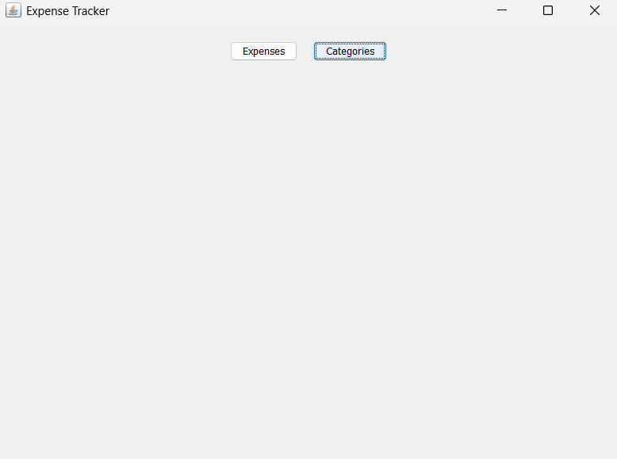
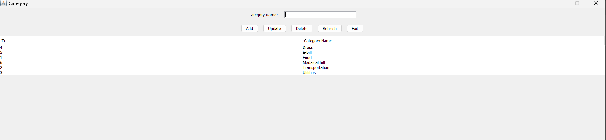
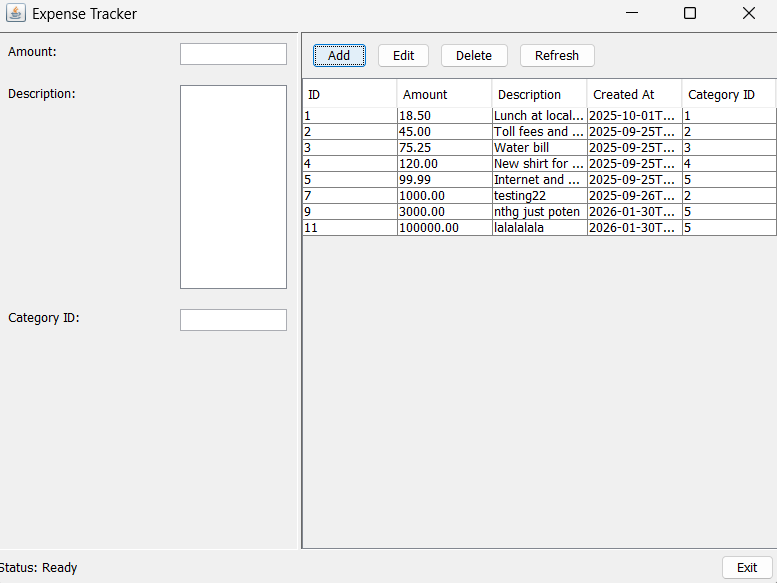

# Expense Tracker Application

##  Project Overview
The **Expense Tracker Application** is a Java-based desktop application designed to help users record, organize, and manage their daily expenses efficiently.  
It allows users to categorize expenses, store them persistently in a MySQL database, and view expense records through an intuitive graphical interface.

The project demonstrates core Java concepts such as **OOP principles, JDBC, MVC architecture, and database integration**, making it suitable for learning and showcasing backend and desktop application development skills.

---

##  Problem Statement
Managing personal expenses manually can be error-prone and inefficient. Users often struggle to track where their money is spent and how much is spent in each category.

This application solves that problem by:
- Structuring expenses into categories
- Persisting data securely in a database
- Providing a simple UI for managing expense records

---

##  Key Features
- Create and manage expense categories
- Add, update, and delete expense records
- Store expenses with amount, category, notes, and date
- Automatic timestamping of expenses
- Persistent storage using MySQL
- Clean and modular MVC-based design

---

## 🛠️ Technology Stack
- **Language:** Java (JDK 11+)
- **UI:** Java Swing
- **Database:** MySQL 8.0+
- **Build Tool:** Maven
- **Architecture:** MVC (Model-View-Controller)
- **Database Access:** JDBC

---

##  Architecture Overview
The application follows the **MVC (Model-View-Controller)** design pattern to ensure clean separation of concerns.

### 🔹 Model
Represents the core business entities:
- `Expense`
- `Category`

### 🔹 View
Responsible for the user interface using Java Swing:
- Main dashboard window
- Forms for managing categories and expenses

### 🔹 Controller / DAO Layer
- Handles business logic
- Performs database operations (CRUD)
- Acts as a bridge between UI and database

### 🔹 Database
- MySQL is used for persistent storage
- Relational schema with proper foreign key constraints

---

##  Database Schema

### Category Table
Stores expense categories.

```sql
CREATE TABLE category (
    catId INT PRIMARY KEY AUTO_INCREMENT,
    catName VARCHAR(100) NOT NULL
);
```
## Expense Table

Stores individual expense records.

```sql
CREATE TABLE expense (
    expenseId INT PRIMARY KEY AUTO_INCREMENT,
    catId INT NOT NULL,
    amount DOUBLE NOT NULL,
    notes TEXT,
    expense_date TIMESTAMP DEFAULT CURRENT_TIMESTAMP,
    FOREIGN KEY (catId) REFERENCES category(catId)
);
```

## Prerequisites

```text
- Java Development Kit (JDK) 11 or higher
- MySQL Server 8.0 or higher
- Maven 3.6 or higher
- Git (optional, for version control)
```

## ⚙️ Installation & Setup

### 1️. Clone the Repository
```bash
git clone <repository-url>
cd ExpenseTracker
```

### 2️. Set Up MySQL Database
```sql
CREATE DATABASE expensetracker;
USE expensetracker;
```

## 3. Database Configuration

Update the database credentials in the following file:

src/main/java/com/expenseTracker/utilities/DatabaseConnection.java

```java
private static final String URL = "jdbc:mysql://localhost:3306/expensetracker";
private static final String USERNAME = "your_username";
private static final String PASSWORD = "your_password";
```

## ▶️ Build & Run

### Build the Project
```bash
mvn clean install
```

### Run Using Maven
```bash
mvn exec:java
```

### Run Using Executable JAR
```bash
java -jar target/expense-tracker-1.0.0.jar
```

## 🏗️ Architecture

The Expense Tracker Application is designed using the **MVC (Model–View–Controller)**
architecture pattern.  
This approach ensures **clear separation of concerns**, improved maintainability,
and better scalability for future enhancements.

---

##  Model Layer

The Model layer represents the **core business data** of the application.

- Contains entity classes such as **Expense** and **Category**
- Each model class maps directly to a corresponding database table
- Encapsulates data fields, constructors, getters, and setters
- Acts as a **Data Transfer Object (DTO)** between the database and application logic
- Maintains data consistency throughout the application lifecycle
- Does **not** contain UI logic or database access logic

**Primary Responsibilities**
- Store expense amount, category reference, notes, and timestamp
- Represent category identifiers and category names

---

##  View Layer

The View layer is responsible for the **user interface and user interaction**.

- Implemented using **Java Swing**
- Displays windows, forms, tables, buttons, and dialogs
- Captures user input such as expense details and category information
- Presents data retrieved from the database in a readable format
- Updates the UI dynamically based on application events
- Contains **no business logic**

**Key Characteristics**
- UI-only responsibility
- Event-driven interaction
- Delegates all processing to the Controller layer

---

##  Controller / DAO Layer

The Controller layer acts as the **central coordinator** of the application.

- Receives user actions from the View layer
- Validates user input (e.g., amount must be positive, category must exist)
- Applies business rules before processing data
- Converts UI input into Model objects
- Communicates with the DAO layer for database operations
- Maintains loose coupling between UI and database logic

### DAO (Data Access Object) Responsibilities
- Executes SQL queries using **JDBC**
- Performs all CRUD operations
- Maps database records to Model objects and vice versa
- Manages database connections and resources safely

---

## 🗄️ Database Layer

The Database layer provides **persistent storage** for the application.

- Uses **MySQL** as the relational database
- Stores data in normalized tables to reduce redundancy
- Enforces referential integrity using foreign key constraints
- Ensures each expense is associated with a valid category
- Automatically timestamps expense records

**Benefits**
- Reliable long-term storage
- Strong data integrity
- Efficient querying and retrieval

---

## 🔄 End-to-End Workflow

1. The user launches the application.
2. The Swing-based UI (View layer) is initialized.
3. The user performs an action (e.g., add expense).
4. The View forwards the action to the Controller.
5. The Controller validates the input data.
6. Valid data is converted into Model objects.
7. DAO executes SQL queries using JDBC.
8. MySQL processes the request.
9. DAO converts results into Model objects.
10. Controller receives the processed data.
11. Controller updates the View.
12. UI refreshes to reflect changes.
13. User receives success or error feedback.

---

## 🎯 Architectural Benefits

- Clear separation of responsibilities
- Improved readability and maintainability
- Easier debugging and testing
- Scalable and extensible design
- Industry-standard architecture suitable for real-world applications


## 📸 Outputs

### Main Dashboard
- Central dashboard for navigating the application
- Provides access to category and expense management



---

### Manage Categories
- Add, update, and delete expense categories
- Ensures expenses are organized correctly



---

### Manage Expenses
- Add and view expenses linked to categories
- Records amount, notes, and timestamp




## 🚀 Future Enhancements

- Monthly and category-wise expense analytics
- Graphical charts and visual reports
- User authentication and multi-user support
- Export expenses to CSV and PDF formats
- Cloud-based database integration

## 📄 License

This project is open-source and free to use, modify, and distribute for educational and personal purposes, with attribution to the original author appreciated.


